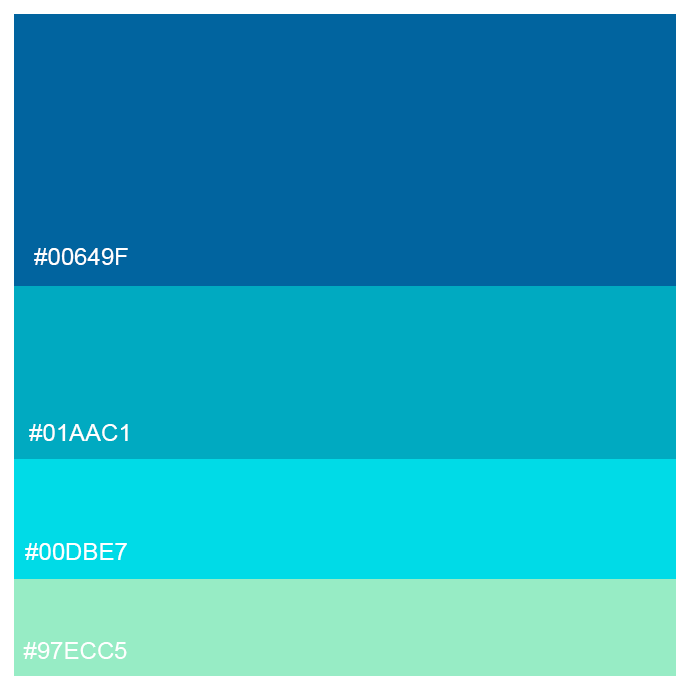
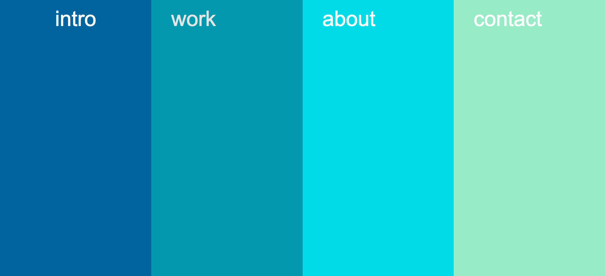
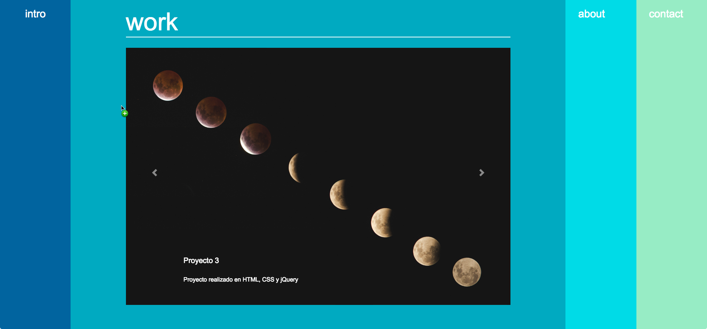

# Proyecto Portafolio

Este proyecto tiene reación con la construcción de mi portafolio personal como Front End Developer Jr. P

## Desarrollo
- Bootstrap
- Javascript
- jQuery
- jQuery UI

## Paleta de colores

  

## Diseño 
La página está formada por un menú a pantalla completa de 4 de columnas que representan cada sección:

INTRO | ABOUT | WORKS | CONTACT

Al hacer click, la sección seleccionada se expande.

### Vistas

Este es el diseño preliminar, cada columna es una sección. La sección proyectos mostrará un proyecto por pantalla, deslizables de derecha a izquierda:

_Vista 1_

  

_Vista 2_

  

